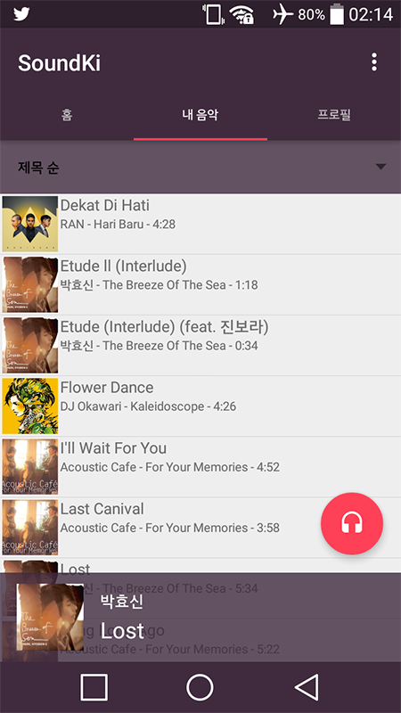

SoundKi
=======

An Android application project that tracks listening to music. This is project that under development.

> 

License
-----

This project follow MIT License.

Build
-----

Android Studio version is 2.2 or later.

For build and run this project, project must connect to Firebase.

And it can on firebase console : https://console.firebase.google.com

JDK version is 1.8 (52.0). When open this project, If android studio shows an error like this:

    Cause: com/android/build/gradle/AppPlugin : Unsupported major.minor version 52.0
Download JDK 1.8 version at this page. 
http://www.oracle.com/technetwork/java/javase/downloads/jdk8-downloads-2133151.html

